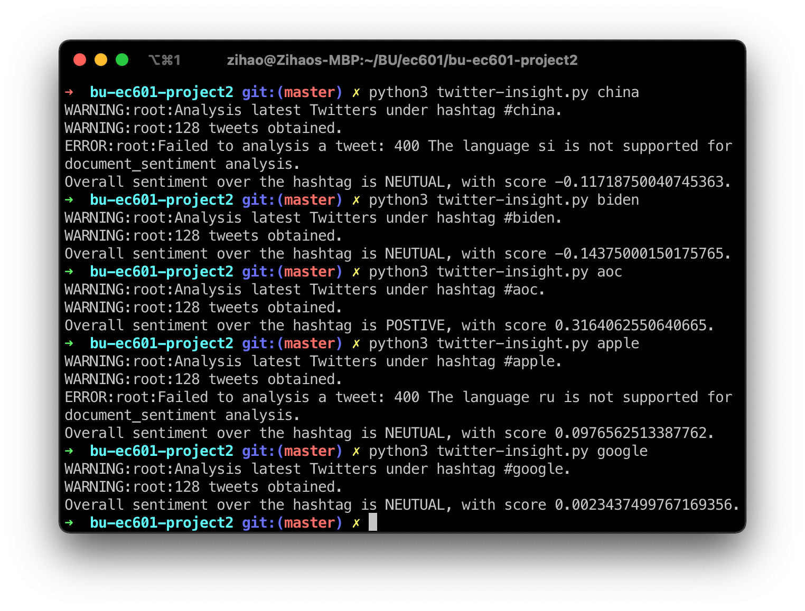

# EC602 Project 2

## Part (a) and Part (b)

### Twitter API

Install dependencies with

```
$ pip3 install -r examples/requirements-twitter.txt
```

Set the access token into the envrinment variable

```
$ export TWITTER_CONSUMER_KEY=<your-consumer-key> \
       TWITTER_CONSUMER_SECRET=<your-consumer-secret> \
       TWITTER_ACCESS_KEY=<your-access-key> \
       TWITTER_ACCESS_SECRET=<your-access-secret>
```

Run the demo bot

```
$ python3 examples/twitter_bot.py <handle>
```

For example

```
$ python3 examples/twitter_bot.py nytimes
```

The dumped Tweets from this user will be saved at `twitter-dump-<handle>.json`.

### Google NLP API

Install dependencies with

```
$ pip3 install -r examples/requirements-nlp.txt
```

Set the access token into the envrinment variable, following https://cloud.google.com/natural-language/docs/reference/libraries#cloud-console

```
$ export GOOGLE_APPLICATION_CREDENTIALS="KEY_PATH"
```

Run the demo

```
$ python3 nlp.py <text_file> [lang]
```

For example

```
$ python3 nlp.py i-have-a-dream.txt en-us
```

## User Stories

See [USER-STORY.md](./USER-STORY.md).

## Final Product

The product will do sentiment analysis with tweets under a hashtag (e.g., `#china`) and show the overall aggregated result for those tweets.

### How to Run

Install dependencies with

```
$ pip3 install -r examples/requirements-nlp.txt
$ pip3 install -r examples/requirements-twitter.txt
```

Set the access token into the envrinment variable

```
$ export TWITTER_CONSUMER_KEY=<your-consumer-key> \
       TWITTER_CONSUMER_SECRET=<your-consumer-secret> \
       TWITTER_ACCESS_KEY=<your-access-key> \
       TWITTER_ACCESS_SECRET=<your-access-secret>
$ export GOOGLE_APPLICATION_CREDENTIALS="KEY_PATH"
```

Run the product:

Run the demo

```
$ python3 twitter-insight.py <hashtag>
```

For example:

```
$ python3 twitter-insight.py google
```

### Result

